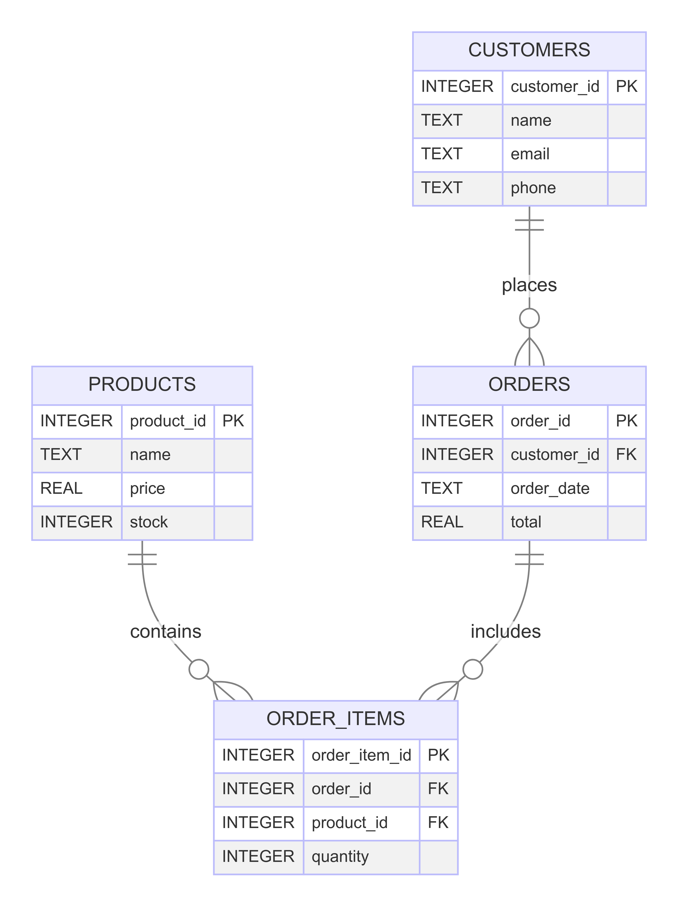

# Bakehub
# Bakehub

Bakehub is a system to manage bakehouse operations using SQLite.

## Project Overview

Bakehub is a management system designed to help small bakehouses manage their products, customers, and orders efficiently. The system uses SQLite for its database, making it lightweight and easy to set up.

## Features

- **Product Management**: Add, update, and delete products with details such as name, price, and stock levels.
- **Customer Management**: Maintain a customer database with names, emails, and phone numbers.
- **Order Management**: Create and manage orders, including the ability to add multiple products to an order.
- **Order Items**: Track individual items within orders.

## Setup

1. **Clone the repository**:
    ```bash
    git clone https://github.com/rajanmanickam23/Bakehub.git
    cd Bakehub
    ```

2. **Initialize the database**:
    ```bash
    sqlite3 bakehub.db < schema.sql
    sqlite3 bakehub.db < sample_data.sql
    ```

## Database Schema

### Tables

- **products**
    - `product_id` (INTEGER, PRIMARY KEY)
    - `name` (TEXT, NOT NULL)
    - `price` (REAL, NOT NULL)
    - `stock` (INTEGER, NOT NULL)

- **customers**
    - `customer_id` (INTEGER, PRIMARY KEY)
    - `name` (TEXT, NOT NULL)
    - `email` (TEXT, NOT NULL)
    - `phone` (TEXT)

- **orders**
    - `order_id` (INTEGER, PRIMARY KEY)
    - `customer_id` (INTEGER, FOREIGN KEY)
    - `order_date` (TEXT, NOT NULL)
    - `total` (REAL, NOT NULL)

- **order_items**
    - `order_item_id` (INTEGER, PRIMARY KEY)
    - `order_id` (INTEGER, FOREIGN KEY)
    - `product_id` (INTEGER, FOREIGN KEY)
    - `quantity` (INTEGER, NOT NULL)

## Sample Data

The `sample_data.sql` file contains initial data for the tables.

## ER Diagram

